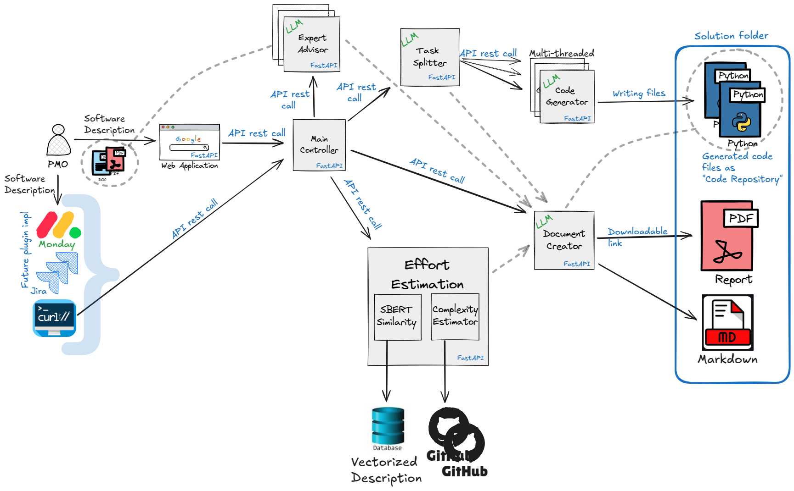
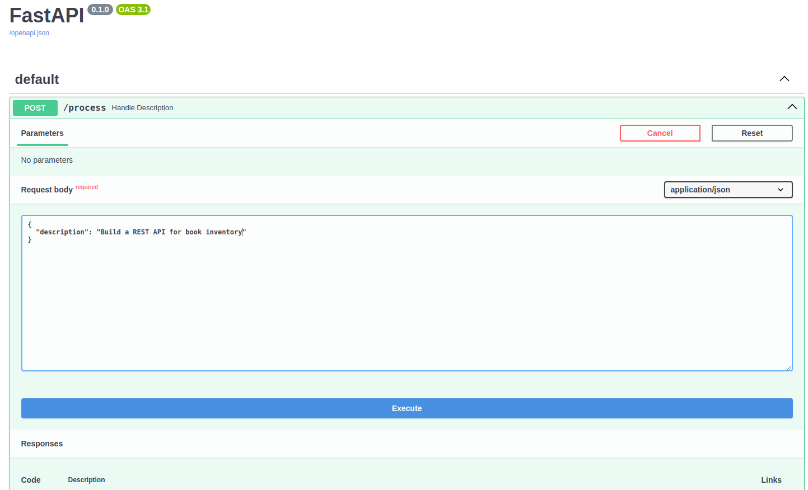
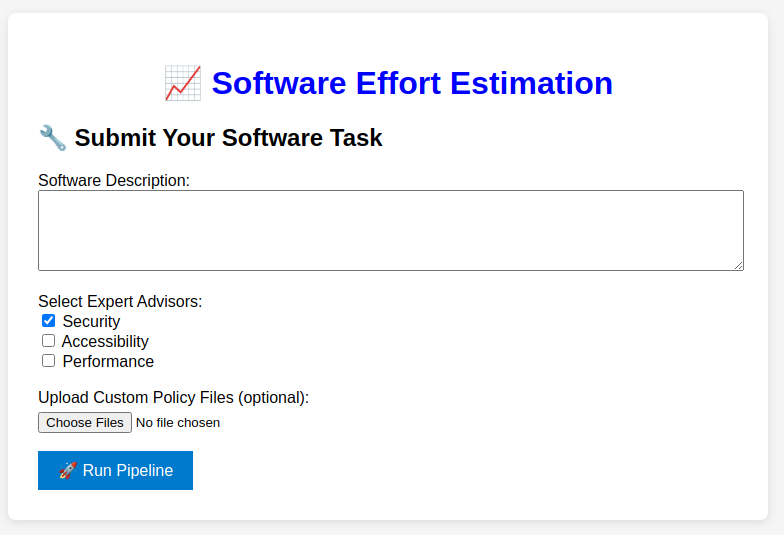

# 🧠 LLM-Pipeline User Manual

---

## 🔍 General Description

The `llm-pipeline` is an AI-driven software effort estimation system. It transforms a natural language description of a software task into a structured implementation plan including subtasks, relevant code snippets, PDF documentation, and estimated complexity metrics. It uses modular FastAPI services for processing and integrates SBERT for semantic similarity, Mistral (via Ollama), and rule-based advisors.

---

## 🚀 Features
- Modular architecture with individual FastAPI microservices
- Code generation using open-source LLM (via Ollama)
- Advisor modules analyze generated code against uploaded domain-specific policies (PDFs)
- Generates a structured summary and downloadable PDF document
- Clean frontend for input submission and result retrieval


---

## 🧱 Architecture Overview




---

## 📦 Components

### 1. **Frontend (`frontend/`)**
- Accepts:
  - Software description (text input)
  - Policy PDFs for:
    - Security
    - Accessibility
    - Performance
  - Other related files
- Sends description to backend for processing
- Displays final download link

### 2. **Main Controller (`main-controller/`)**
- Orchestrates the flow:
  - Sends description to `task-splitter`
  - Sends subtasks to `code-generator`
  - Sends data to `tool-x-connector`
  - Creates a default security policy file
  - Triggers `document-creator`

### 3. **Task Splitter (`task-splitter/`)**
- Uses LLM to split software description into actionable subtasks

### 4. **Code Generator (`code-generator/`)**
- Generates Python code per subtask using LLM
- Saves code under `generated-code/<uuid>/`

### 5. **Tool X Connector (`tool-x-connector/`)**
- Placeholder for integration with custom tools (e.g., testing, deployment)

### 6. **Expert Advisor (`expert-advisor/`)**
- Reads uploaded policy PDFs (security, accessibility, performance)
- Extracts their text using `PyPDF2`
- Uses LLM to provide compliance recommendations based on policies

### 7. **Document Creator (`document-creator/`)**
- Builds a Markdown summary:
  - Description
  - Subtasks
  - Code
  - Expert feedback
- Converts to PDF using `WeasyPrint`
- Makes the PDF available for download

### 8. **Effort Estimation (`sbert_complexity_estimator/`)**

The `sbert_complexity_estimator` module is responsible for estimating software development effort based on a provided task description and/or local codebase. It combines **semantic similarity (via SBERT)** and **static complexity analysis** to deliver realistic PERT-based effort estimates in hours and days.

#### 🔍 Components

- **`get_similarity_repositories_sbert.py`**  
  Loads SBERT-encoded GitHub repository descriptions from a pre-vectorized SQLite DB (`sdee_lite_description_vectorized.sql`) and ranks them by cosine similarity against the input task description.

- **`github_repo_complexity_evaluator_multiple_to_see.py`**  
  Clones top-matching GitHub repos and applies complexity analysis using a hybrid of:
  - Lines of Code (LOC)
  - Cyclomatic Complexity
  - Halstead Volume
  - Cognitive Complexity
  - AST Depth  
  The result is transformed into effort via an academically grounded **PERT estimation model**.

- **`code_effort_estimator.py`**  
  Implements the core complexity model, normalizations, heuristic fallbacks, and PERT-based time estimation logic. The final result includes optimistic, most likely, and pessimistic durations.

- **`effort_estimator_combined.py`**  
  FastAPI wrapper for estimating effort on both:
  1. **Top-5 semantically similar GitHub repos**
  2. **A local folder** (e.g., generated code)  
  It removes outliers and returns both a per-repo breakdown and an average GitHub-based estimation for comparison.

#### 🧪 Example REST Call

To trigger effort estimation on a task description:

```bash
curl -X POST http://localhost:8007/estimate-all \
  -H "Content-Type: application/json" \
  -d '{"description": "Build a Flask service to expose machine learning model predictions.", "local_folder_path": "generated-code/mytask123"}'
```
### 📈 Output Summary

Each estimation returns:

- C_comp: Composite complexity score

- Optimistic, Most Likely, Pessimistic: PERT-based duration estimates

- Effort (days) and hours: Adjusted time predictions based on codebase size

These results help you compare estimated effort between:

- Public GitHub repositories (baseline analogs)

- Generated code folders (actual output of the pipeline)


---
## 💻 Installation Instructions

### 1. 🧪 Python Environment (All OS)

```bash
# Clone the project
git clone https://github.com/YoavLevinger/see.git
cd see/llm-pipeline

# Create virtual environment
python3 -m venv venv
source venv/bin/activate  # On Windows: venv\Scripts\activate

# Install Python dependencies
pip install -r requirements.txt
```

### 2. 🤖 Install Ollama + Mistral

**Linux / macOS / Windows (WSL):**
```bash
# Install Ollama
curl -fsSL https://ollama.com/install.sh | sh

# Start Ollama service
ollama serve &

# Pull Mistral model
ollama run mistral
```

More at: [https://ollama.com](https://ollama.com)

---

## ▶️ Running the Solution

```bash
# Ensure Ollama is running
ollama run mistral &

# Start backend services
./run-all.sh
```

Access the FastAPI main controller:

```
http://localhost:8080/docs
```
note: each of the components has a /docs section (swagger like) enables decoupling. 



Or via the more user friendly web ui
```
http://localhost:8090/
```


Trigger processing:
```bash

curl -X POST http://localhost:8080/process \
     -H "Content-Type: application/json" \
     -d '{"description": "Build a REST API for book inventory"}'
```

---

## 🧑‍💻 How to Use

1. Submit task descriptions via UI or REST API.
2. The system splits, generates, advises, and documents.
3. Final output is stored in `generated-code/` as folders per task.

---

## ⚙️ Calibrating Number of Workers

### In `run-all.sh`
```bash
uvicorn backend.code-generator.code_generator:app --port 8002 --workers 16 &
```

### In `main_controller.py`
```python
executor = ThreadPoolExecutor(max_workers=5)
```

Adjust values to control concurrency.

---

## 🌐 Frontend Overview

Located under `/frontend`, this UI allows:

- Task submission
- Real-time progress tracking
- Result download

---

## 🧩 Backend Module Overview

| Module               | Role |
|----------------------|------|
| `main-controller`    | Entry point, orchestrates the flow |
| `task-splitter`      | Breaks tasks into subtasks |
| `code-generator`     | Generates code for subtasks |
| `tool-x-connector`   | Suggests third-party tool usage |
| `document-creator`   | Creates PDF report |
| `expert-advisor`     | Provides rule-based tooling advice |
| `sbert_complexity_estimator` | Measures code complexity |
| `shared`             | Common models/utilities |

---

## 📂 Output Structure (`generated-code/`)

Each processed task creates a folder:

```
generated-code/
└── <task_id>/
    ├── code files...         # Code per dev subtask
    ├── summary.pdf           # Generated pdf report
    ├── summary.md            # Generated md format report
    └── summary.html          # Generated html report
```

The "summary.pdf" is also available for download from the weg ui or via link written back to the console after the curl call.

---

## 📤 Upload Tips
- Attach **1 PDF per advisor type** (named automatically as `policy.<type>.pdf`)
- You can also upload other `.txt`/`.py` reference files

---

## 📓 Logs
Logs are saved under `logs/` with separate files per component.

---

## 📌 Notes
- This system runs **entirely locally**, no cloud or closed API usage
- You can customize advisors to handle other domains (e.g., legal, ethical)

