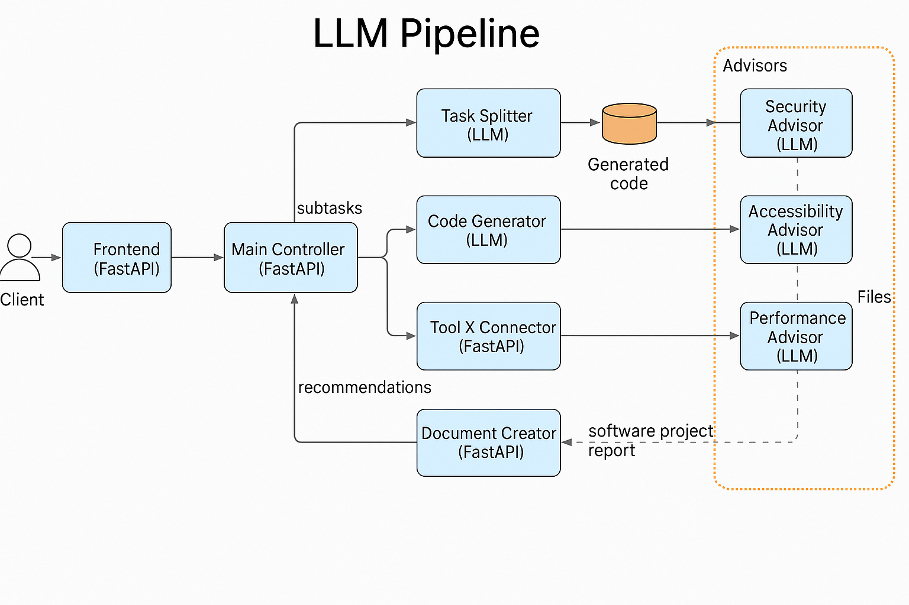

# LLM Modular Pipeline for Software Generation and Compliance

This is a modular, locally-hosted pipeline that takes a software description, breaks it into subtasks, generates code for each, applies custom tooling, and produces a comprehensive PDF summary that includes expert compliance recommendations (e.g., security, performance).

---

## 🚀 Features
- Modular architecture with individual FastAPI microservices
- Code generation using open-source LLM (via Ollama)
- Advisor modules analyze generated code against uploaded domain-specific policies (PDFs)
- Generates a structured summary and downloadable PDF document
- Clean frontend for input submission and result retrieval

---

## 🧱 Architecture Overview

```plaintext
User UI  -->  Frontend API  -->  Main Controller
                            |       |
                            |       ├─> Task Splitter (LLM)
                            |       ├─> Code Generator (LLM)
                            |       ├─> Tool X Connector
                            |       ├─> Expert Advisor (per policy PDF)
                            |       └─> Document Creator
                            ↓
                      PDF Summary Document
```



---

## 📦 Components

### 1. **Frontend (`frontend/`)**
- Accepts:
  - Software description (text input)
  - Policy PDFs for:
    - Security
    - Accessibility
    - Performance
  - Other related files
- Sends description to backend for processing
- Displays final download link

### 2. **Main Controller (`main-controller/`)**
- Orchestrates the flow:
  - Sends description to `task-splitter`
  - Sends subtasks to `code-generator`
  - Sends data to `tool-x-connector`
  - Creates a default security policy file
  - Triggers `document-creator`

### 3. **Task Splitter (`task-splitter/`)**
- Uses LLM to split software description into actionable subtasks

### 4. **Code Generator (`code-generator/`)**
- Generates Python code per subtask using LLM
- Saves code under `generated-code/<uuid>/`

### 5. **Tool X Connector (`tool-x-connector/`)**
- Placeholder for integration with custom tools (e.g., testing, deployment)

### 6. **Expert Advisor (`expert-advisor/`)**
- Reads uploaded policy PDFs (security, accessibility, performance)
- Extracts their text using `PyPDF2`
- Uses LLM to provide compliance recommendations based on policies

### 7. **Document Creator (`document-creator/`)**
- Builds a Markdown summary:
  - Description
  - Subtasks
  - Code
  - Expert feedback
- Converts to PDF using `WeasyPrint`
- Makes the PDF available for download

---

## 📁 File Layout

```
llm-pipeline/
├── backend/
│   ├── task-splitter/
│   ├── code-generator/
│   ├── tool-x-connector/
│   ├── expert-advisor/
│   ├── document-creator/
│   ├── main-controller/
│   └── shared/
├── frontend/
│   ├── app.py
│   ├── templates/index.html
│   └── static/
├── generated-code/
│   └── <uuid>/...
├── logs/
│   ├── frontend.log
│   └── expert-advisor.log
└── run-all.sh
```

---

## ⚙️ Prerequisites
- Python 3.10+
- `ollama` with an open-source model like `mistral`
- Dependencies in `.venv` (use `requirements.txt` if generated)
- Installed tools:
  - `uvicorn`
  - `fastapi`
  - `PyPDF2`
  - `jinja2`
  - `weasyprint`

---

## 🧪 Running the System
```bash
cd llm-pipeline
./run-all.sh
```
This will start all services on their designated ports.
Frontend runs at: [http://localhost:8090](http://localhost:8090)

---

## 📤 Upload Tips
- Attach **1 PDF per advisor type** (named automatically as `policy.<type>.pdf`)
- You can also upload other `.txt`/`.py` reference files

---

## 📓 Logs
Logs are saved under `logs/` with separate files per component.

---

## 📌 Notes
- This system runs **entirely locally**, no cloud or closed API usage
- You can customize advisors to handle other domains (e.g., legal, ethical)

